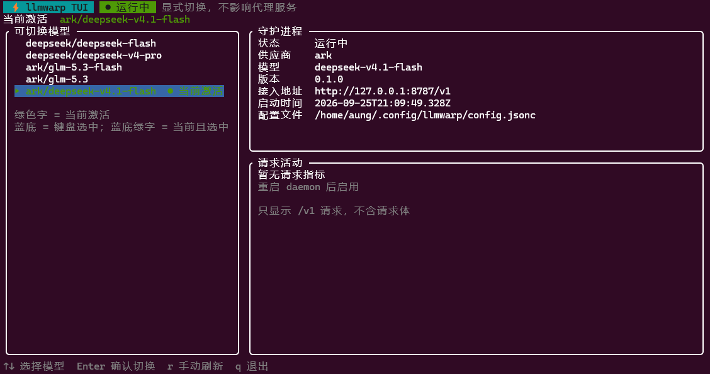

# llmwarp

> 本地 OpenAI 协议路由，随时切换 LLM API 供应商。

只改一次客户端配置：Codex 等任意 OpenAI 兼容客户端指向本机的
`http://127.0.0.1:<port>/v1`（端口可配，默认 `8787`），之后用 `llmwarp` 一键切换「用哪家、用哪个模型」。



## 它解决什么问题

- 客户端（Codex、各类 OpenAI SDK、编辑器插件……）的 base URL 与模型名通常写死在配置里，换供应商就得改一次。
- llmwarp 在本机起一个 OpenAI 兼容端点，把客户端发来的 `model` 路由到对应供应商：填 `warp` 用你当前选中的模型，填 `{provider}/{model}` 用指定的模型，并用你为该供应商配置的 key 转发。
- 于是客户端的 `baseUrl` 固定为本机、`apiKey` 随便填、`model` 从 `GET /v1/models` 里挑；切换只发生在 llmwarp 侧，**客户端无需重启**。

## 工作原理

```
OpenAI 兼容客户端 ──▶ 127.0.0.1:<port>/v1 ──▶ llmwarp 守护进程 ──▶ 当前供应商（OpenAI 兼容）
      ◀── SSE 流式回传 ◀── 改写 model / 注入 apiKey ◀──
                                  ▲
                                  │ 回环 + token 的本地管理请求
                            llmwarp CLI / TUI
```

- 仅监听 `127.0.0.1`，不对外暴露。
- 监听端口取自配置的 `port`，未配置时默认 `8787`；以 `llmwarp status` 显示的接入地址为准。
- 上游 URL = `joinUrl(baseUrl, 客户端路径去掉 /v1 前缀)`。例：`baseUrl = https://api.deepseek.com/v1`，请求 `/v1/chat/completions` → `https://api.deepseek.com/v1/chat/completions`；`baseUrl` 不要求以 `/v1` 结尾。
- JSON 请求体里的 `model` 决定路由：`warp`（或缺失）用当前激活模型，`{provider}/{model}` 用指定供应商的模型（只按第一个 `/` 拆分），上游收到的 `model` 会去掉供应商前缀。名字必须是 `GET /v1/models` 列出的值，否则返回本地 JSON 错误、不转发上游；响应（含 SSE）边收边发，不缓冲。
- 请求开始时快照当前供应商/模型，切换不影响进行中的请求。

## 安装

需要 Node.js 20+。项目未发布到 npm，从源码构建：

```bash
npm install
npm run build
npm link        # 之后全局可用 llmwarp
```

开发时可直接跑源码，无需 build：

```bash
npm run dev -- status
```

## 快速开始

```bash
llmwarp init      # 生成带注释的示例配置 ~/.config/llmwarp/config.jsonc
llmwarp add       # 向导式新增供应商（预置 OpenAI / DeepSeek / OpenRouter / Ollama）
llmwarp use       # 交互式选择供应商与模型；守护进程未运行会自动启动
llmwarp status    # 查看当前状态
```

然后把客户端指过来：

| 客户端字段 | 填写 |
| --- | --- |
| Base URL | `http://127.0.0.1:<port>/v1`，默认 `8787`；准确值看 `llmwarp status` 的「接入地址」 |
| API Key | 任意非空值（如 `any`）—— llmwarp 忽略它，改用供应商的 key |
| Model | `warp`（用当前选择），或 `/v1/models` 里的 `{provider}/{model}` |

```bash
# 端口默认 8787；换成本机 `llmwarp status` 输出的「接入地址」
curl http://127.0.0.1:8787/v1/chat/completions \
  -H 'content-type: application/json' \
  -d '{"model":"warp","messages":[{"role":"user","content":"hi"}]}'
```

端口不是写死的：以配置文件里的 `"port"` 为准（未配置时用默认值 `8787`）；也可以用
`llmwarp serve --port <n>` 前台运行并临时指定。启动守护进程或 `llmwarp use` 成功后都会打印真实接入地址，
`llmwarp status` 也可随时查看。

## TUI

`llmwarp tui` 打开常驻管理界面（即上方截图）：左侧列出可切换的模型并标记当前激活项，右侧显示守护进程状态与最近的 `/v1` 请求活动。

- `↑` / `↓`（或 `j` / `k`）移动，`Enter` 后按 `y` 确认切换
- `r` 手动刷新（默认每 3 秒自动刷新）
- `q` 或 `Ctrl-C` 退出（退出不影响后台守护进程）

> 请求活动来自守护进程内存里的指标，daemon 重启后才会重新统计，因此刚重启时会显示「暂无请求指标」。

## 命令

| 命令 | 说明 |
| --- | --- |
| `llmwarp` | 无参数时打开交互式菜单 |
| `llmwarp init [--force]` | 生成带注释的示例配置 |
| `llmwarp add` | 向导式新增供应商 |
| `llmwarp edit [provider] [--file]` | 编辑供应商，或用 `$EDITOR` 打开配置文件 |
| `llmwarp list`（`ls`）`[--offline]` | 列出供应商，并检查可用性 |
| `llmwarp use [provider] [--model <m>] [--list] [--refresh]` | 切换供应商/模型 |
| `llmwarp status`（`st`） | 查看配置路径、端口、接入地址、当前供应商/模型 |
| `llmwarp tui` | 打开常驻管理界面 |
| `llmwarp remove [provider]`（`rm`） | 移除供应商 |
| `llmwarp start` / `llmwarp stop` | 后台启动 / 停止守护进程 |
| `llmwarp serve [--port <n>]` | 前台运行守护进程 |
| `llmwarp reload` | 让守护进程重载配置 |

## 配置

配置文件位于 `~/.config/llmwarp/config.jsonc`（遵循 XDG：优先 `$XDG_CONFIG_HOME/llmwarp`），
JSONC 格式，支持 `//` 注释与尾逗号：

```jsonc
{
  "port": 8787,                      // 监听端口，可改；不写则用默认 8787
  "activeProvider": "deepseek",      // 由 llmwarp use 维护
  "activeModel": "deepseek-chat",
  "useClientModel": true,            // true 尊重客户端指定的模型；false 统一落到当前激活模型
  "providers": {
    "deepseek": {
      "baseUrl": "https://api.deepseek.com/v1",
      "apiKey": "${DEEPSEEK_API_KEY}", // 支持 ${ENV_VAR} 引用环境变量，避免明文落盘
      "models": ["deepseek-chat", "deepseek-reasoner"]
    }
  }
}
```

- 手改配置后运行 `llmwarp reload`；或用 `llmwarp edit --file` 在 `$EDITOR` 中打开，保存后自动 reload。
- `models` 可省略：此时 `llmwarp use`（或 `--refresh`）会请求 `<baseUrl>/models` 拉取模型列表。
- `GET /v1/models` 本地返回 `warp` 与所有 `{provider}/{model}`（不含密钥）；`useClientModel` 两种取值下，客户端传的 `model` 都必须是这个列表里的名字。
- 名字规则：供应商名不能含 `/`（第一个 `/` 是路由分隔符）、空白或控制字符，`llmwarp add` 会直接拒绝这类名字；模型名不能含空白或控制字符，否则不会出现在 `/v1/models` 里。
- 配置文件写入权限为 `0600`、配置目录为 `0700`；密钥建议用 `${ENV_VAR}` 而非明文。
- 守护进程运行时状态在 `~/.config/llmwarp/daemon.json`（含本机管理接口 token），日志在 `~/.config/llmwarp/daemon.log`。

## 开发

```bash
npm run dev        # tsx 直接运行 src/cli.ts
npm test           # node --test（test/*.test.ts）
npm run typecheck  # tsc --noEmit
npm run build      # tsup 打包到 dist/cli.js
```

源码结构：

| 路径 | 职责 |
| --- | --- |
| `src/cli.ts` | 命令注册（Commander） |
| `src/commands.ts` | 各子命令实现 |
| `src/config.ts` | 配置读写、校验、路径 |
| `src/server.ts` | 守护进程：代理入口 + 管理接口 |
| `src/proxy.ts` | 转发、model 改写、请求/响应头处理 |
| `src/daemon.ts` | 守护进程生命周期与管理请求 |
| `src/tui/` | 常驻 TUI（状态、渲染、按键） |
| `src/metrics.ts` | 请求指标统计 |
| `src/health.ts`、`src/net.ts` | 可用性检查与端口占用排查 |

设计与任务文档位于 `docs/` 与 `.trellis/`。
